# SSM博客
基于 SSM 实现的博客系统，包含用户注册、登录、找回密码，文章管理、分类管理、标签管理、评论管理、用户管理、角色管理和权限管理等功能。 
预览地址：[http://easyjava.com.cn:8080/](http://easyjava.com.cn:8080/)
## 技术组成
该项目分为 SpringBoot 和 SSM 两个版本，当前仓库代码属于 SSM 版本

- [初云博客-SpringBoot版本](https://github.com/saysky/ChuyunBlog)
- [初云博客-SSM版本](https://github.com/saysky/ChuyunBlog-SSM)

两者功能基本一致，技术组织不同。

- SSM 版本：Spring+SpringMVC+MyBatis+Thymeleaf+BootStrap

该项目最近写了一篇 10000 字的论文，作为参考  
- SpringBoot 版本：SpringBoot+MyBatis+Shiro+Thymeleaf+BootStrap

## 预览
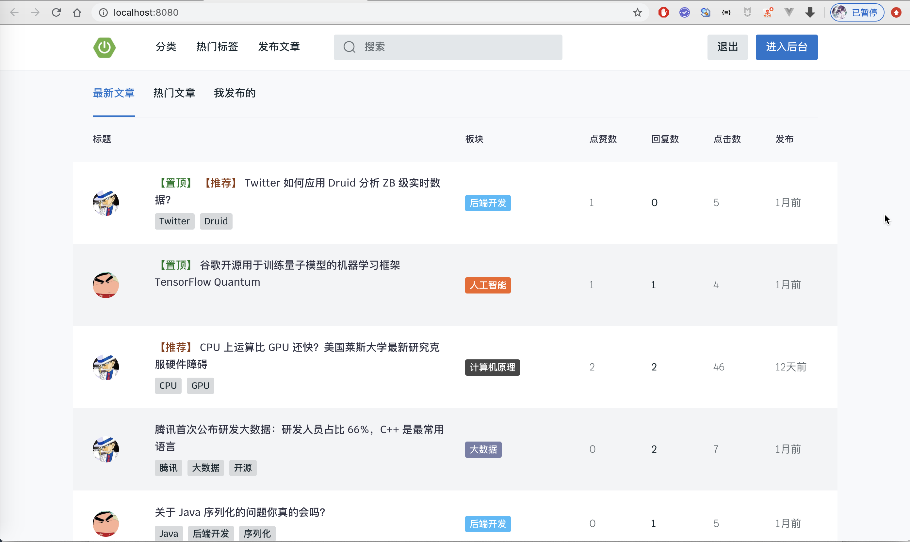
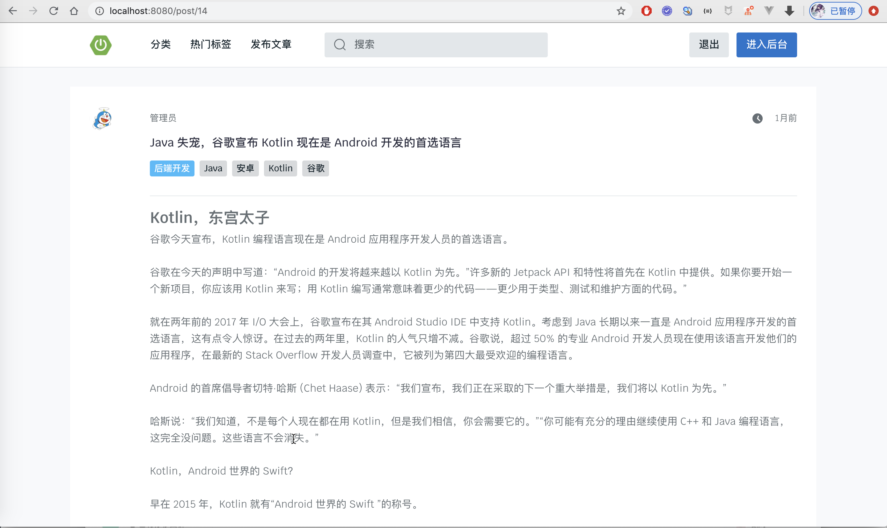

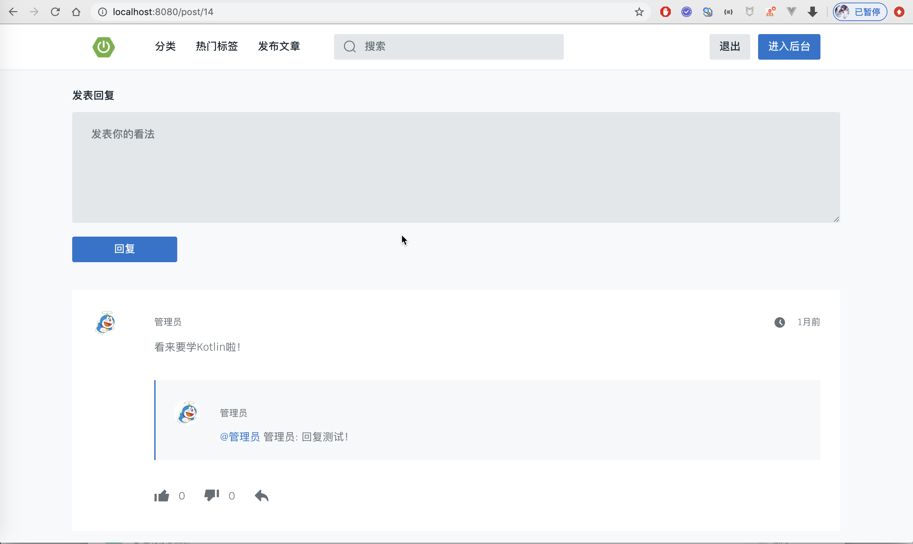
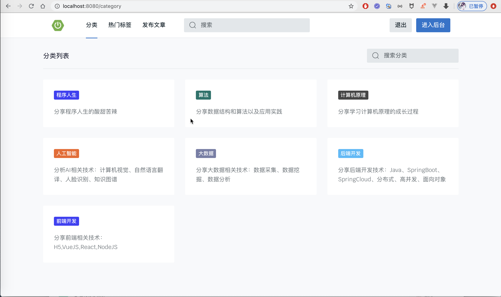
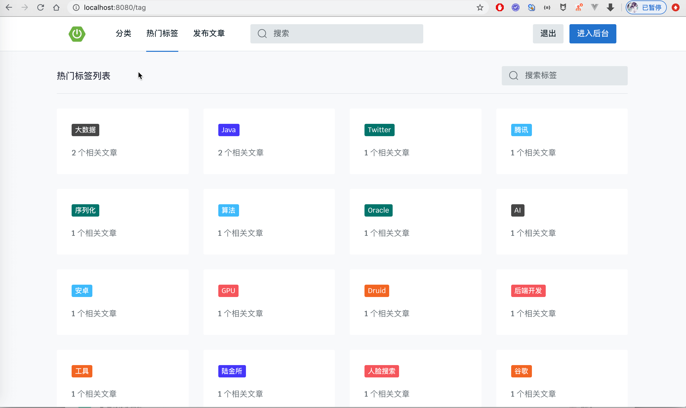
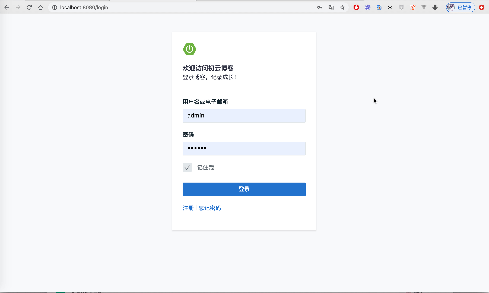

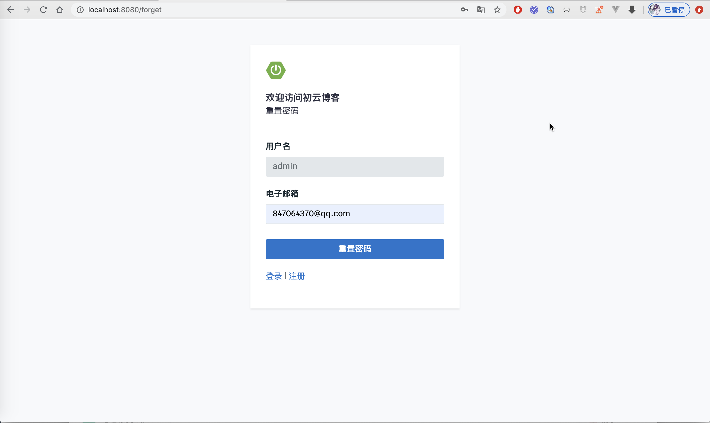
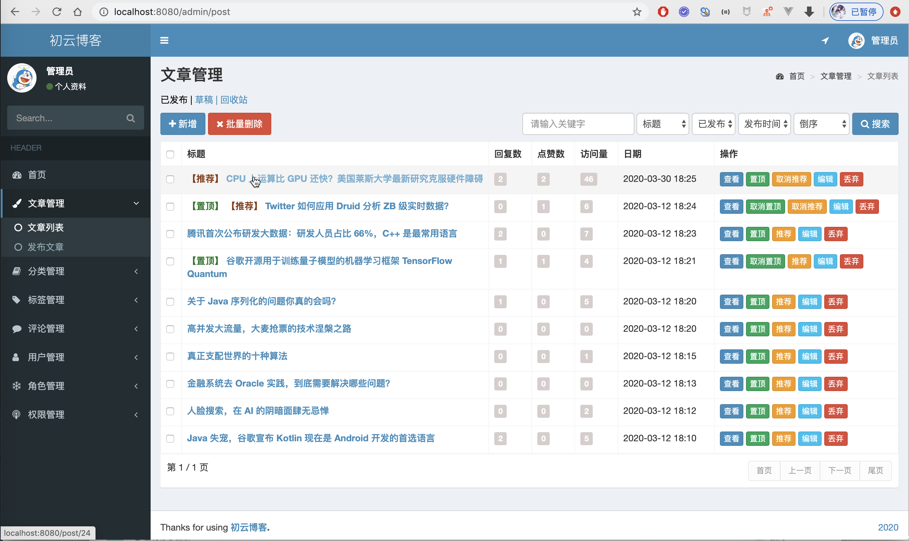

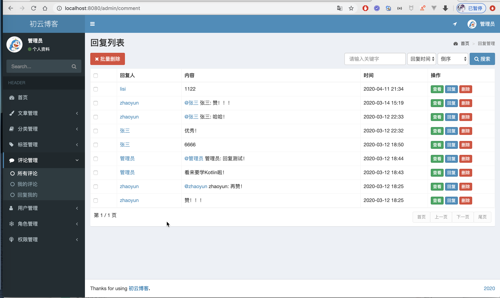
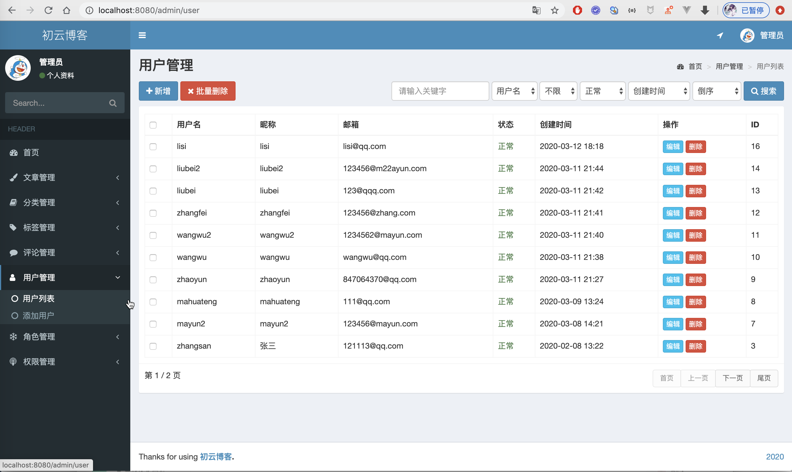
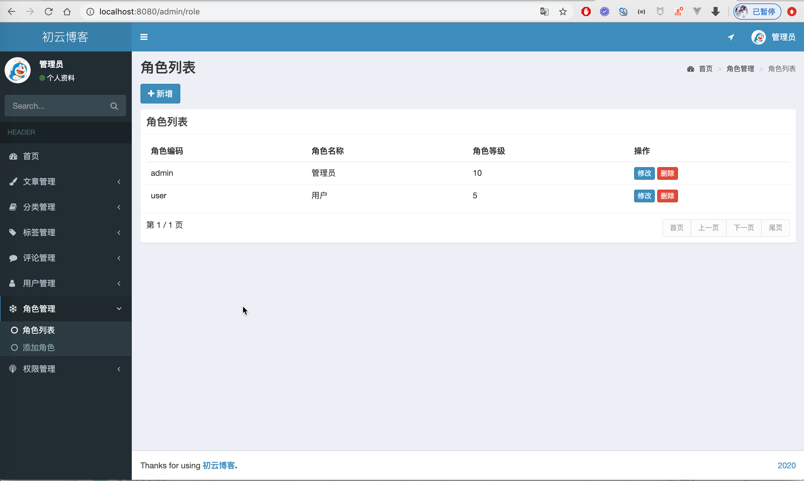

## 联系方式
需要完整代码，联系本人，提供代码讲解服务  
微信：847064370
